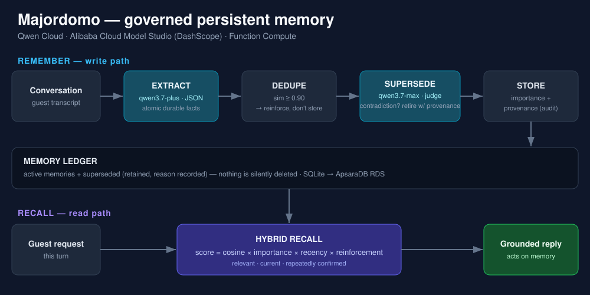

# Majordomo — the concierge that never forgets

**Qwen Cloud Global AI Hackathon · MemoryAgent track.**

A guest-service agent with **governed persistent memory**: it doesn't just
store what guests say — it deduplicates, detects contradictions, supersedes
stale preferences with full provenance, and **proves** it makes increasingly
accurate decisions across sessions with a built-in evaluation harness.

## The problem with memory agents

Naive memory agents append everything and retrieve by similarity. Over
sessions the store fills with duplicates and contradicted facts, and recall
quality *degrades with experience* — the guest who switched from cappuccino
to matcha keeps getting cappuccino, because three stale memories outvote one
current one. More memory makes the agent worse.

## What Majordomo does differently



Every remembered fact goes through a **governance pipeline** (Qwen-powered):

```
conversation transcript
   │ EXTRACT    Qwen distills atomic, durable guest facts (JSON mode)
   ▼
   │ DEDUPE     same fact again? -> reinforce the existing memory
   ▼
   │ SUPERSEDE  same topic, changed fact? -> Qwen contradiction check;
   │            stale memory is retired WITH provenance (kept for audit,
   │            excluded from recall) — "always coffee" vs "never coffee"
   │            embed nearly identically, so even near-duplicates get the check
   ▼
   │ RECALL     hybrid score: similarity x importance x recency x reinforcement
   ▼
grounded concierge response
```

And the claim is **measured, not asserted**: `majordomo eval` runs scripted
returning-guest personas through both Majordomo and an append-only baseline,
quizzing each after every stay with a Qwen judge. When a guest changes a
preference mid-history, the baseline's accuracy drops — Majordomo's holds.

```
Eleanor Voss   governed  accuracy by stay: [1.0, 1.0, 1.0]
Eleanor Voss   naive     accuracy by stay: [1.0, 1.0, 0.8]   <- recalls stale preference
```

## Stack

- **Qwen Cloud** — `qwen3.7-plus` (agent + extraction), `qwen3.7-max` (judge),
  `text-embedding-v4` (1024-dim memory embeddings), via the OpenAI-compatible
  endpoint over plain `httpx`
- **Alibaba Cloud** — inference runs on **Model Studio (DashScope)**; the
  backend deploys to **Function Compute** (see [Alibaba Cloud usage](#alibaba-cloud-usage))
- SQLite memory ledger (swaps to ApsaraDB RDS in deployment) — nothing is
  deleted; superseded memories remain auditable with reasons

## Quickstart

```bash
python -m venv .venv && .venv/Scripts/activate
pip install -e ".[charts]"
cp .env.example .env          # add QWEN_API_KEY; or keep LLM_BACKEND=mock

majordomo demo                # scripted 3-stay walkthrough of one guest
majordomo chat --guest g-me   # interactive; memory persists across runs
majordomo memory --guest g-me # inspect the ledger: active + superseded + why
majordomo eval                # governed-vs-naive accuracy curve + chart
```

The **mock backend** (`LLM_BACKEND=mock`) runs the entire pipeline — including
the eval harness — deterministically with zero API keys, so tests run in CI
and the architecture is verifiable offline. Switch to `qwen` for the real
platform.

## Tests

```bash
python -m pytest tests -q
```

Covers the three governance paths (store / dedupe-reinforce /
contradiction-supersede), recall ranking, and the harness invariant that
governed memory beats append-only after a preference change.

## Alibaba Cloud usage

Majordomo uses Alibaba Cloud two independent ways — either one satisfies the
hackathon's "code file demonstrating use of Alibaba Cloud services and APIs":

1. **Inference — Alibaba Cloud Model Studio (DashScope).** Every chat,
   contradiction-judge, and embedding call runs on Qwen models served by
   Model Studio at `dashscope-intl.aliyuncs.com`.
   → Proof file: [`src/majordomo/llm.py`](src/majordomo/llm.py) (`QwenClient`).
2. **Deployment — Alibaba Cloud Function Compute.** The governed-memory engine
   is deployed as an FC web function (Singapore / `ap-southeast-1`) with a
   public HTTP endpoint.
   → Proof files: [`fc/index.py`](fc/index.py), [`fc/s.yaml`](fc/s.yaml).

**Live endpoint:** `https://<function-url>/health` → returns the FC-injected
Alibaba Cloud region + identity. `POST /chat` runs a real governed-memory turn.

Deploy: `npm i -g @serverless-devs/s` → `cd fc && s deploy` (region must be an
international one — a China-mainland region forces ~3-day real-name verification).

## License

Apache-2.0
